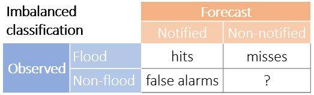

# EFAS skill assessment

Analysis of the skill of [EFAS (Europen Flood Awareness System)](https://www.efas.eu/en) formal flood notifications since the deployment of EFAS v4 (October 2020).

## 1 Structure of the repository

The repository contains six folders:

* [conf](https://github.com/casadoj/EFAS_skill/tree/cleaning/conf) contains the configuration file (_config.yml_) used by all notebooks.
* [data](https://github.com/casadoj/EFAS_skill/tree/cleaning/data) contains the original data used in the analysis (whenever the size is suitable to be stored in GitHub).
* [docs](https://github.com/casadoj/EFAS_skill/tree/cleaning/docs) contains several documents associated to the development of the repository: the EGU documents, presentations in meetings...
* [env](https://github.com/casadoj/EFAS_skill/tree/cleaning/env) contains the file _environment.yml_ with the Conda environment used to run this repository.
* [notebook](https://github.com/casadoj/EFAS_skill/tree/cleaning/notebook) contains the notebooks used to develop the analysis.
* [py](https://github.com/casadoj/EFAS_skill/tree/cleaning/py) contains Python files with functions created during the analysis.
* [results](https://github.com/casadoj/EFAS_skill/tree/cleaning/results) is used to save datasets and plots produced by running the notebooks.

## 2 Data

The analysis is limited to the [EFAS fixed reporting points](https://github.com/casadoj/EFAS_skill/blob/cleaning/data/reporting_points/Station-2022-10-27v12.csv) with a catchment area larger than 500 km² (2357 points).

The original datasets used for the study are:

* EFAS v4 discharge reanalysis (_water balance_). This discharge data was downloaded from the [Copernicus Climate Data Store](https://cds.climate.copernicus.eu/#!/home) (CDS) for the complete EFAS domain, and then the time series specific to each reporting point was extracted and saved as NetCDF files in the [_data/discharge/reanalysis/_](https://github.com/casadoj/EFAS_skill/tree/cleaning/data/discharge/reanalysis) folder. Due to file size limitations in GitHub, the original files downloaded from the CDS are not in the repository.
* EFAS v4 discharge forecast. This data was extracted by Corentin from the Meteorological Archival and Retrival System (MARS) and provided as NetCDF files for each forecast date and model (COSMO, ECMWF-HRES, ECMWF-ENS, DWD). Due to the size of these files, the original files are not included in the repository.
* The [discharge return periods](https://github.com/casadoj/EFAS_skill/blob/cleaning/data/thresholds/return_levels.nc) associated to each reporting point. Even though the data set contains several return periods (1.5, 2, 5, 10, 20 years, ...), the analysis only uses the 5-year return period.

## 3 Methods

The whole analysis consists of 4 (5) major steps:

### 3.1 Preprocess the discharge reanalysis

This step is carried out in this [notebook](notebook/2_reanalysis_preprocessing.ipynb). The "observed" discharge time series for each reporting point is compared against its defined return period ($Q_{rp}$) to produce time series of exceedance over threshold. In principle, the time series of exceedance should be binary (0, non-exceedance; 1, exceedance); however, to allow for minor deviations between "observed" and forecasted discharge, a reducing factor ($\lambda$) can be used to create ternary time series of exceedance:

* 0: $Q \lt \lambda \cdot Q_{rp}$
* 1: $\lambda \cdot Q_{rp} \le Q \lt Q_{rp}$
* 2: $Q_{rp} \le Q$).

Parameters in the [configuration file](config/config.yml) specifically involved in this step:

* `rp`: return period (years) associated to the discharge threshold ($Q_{rp}$).
* `reducing_factor`: it not None, a value between 0-1 that reduces the discharge threshold ($Q_{rp}$) in order to produce the 3-class exceedance time series explained above.
* `file_thresholds`: location of the NetCDF file with the discharge associated to several return period for all the fixed reporting points.
* `paths:output:exceedance:reanalysis` is the directory where the output of this step will be saved.

### 3.2 Preprocess the forecast discharge

This [notebook](notebook/4_forecast_preprocessing.ipynb) preprocesses the discharge forecasts. The objective is the same as the previous step, i.e., to create a data set of exceedances over threshold, but in this case for the forecasts. The procedure is, however, a bit more complex since it involves overlapping forecasts from 4 numerical weather predictors (NWP) that, in some cases, have several runs (members) in every forecast.

As in the reanalysis, the output of the forecast preprocessing are NetCDF files with the time series of exceedance over threshold. Depending on whether the `reducing_factor` is enabled or not, the NetCDF files will contain one or two variables: the exceedance over the discharge threshold ($Q_{rp}$), and, if applicable, the exceedance over the reduced discharge threshold ($\lambda \cdot Q_{rp}$). In any case, the dataset contains values in the range 0-1 with the proportion of model runs (members) that exceeded the specific discharge threshold. For the deterministic NWP (DWD and ECMWF-HRES) values can only be either 0 or 1.

Parameters in the [configuration file](config/config.yml) specifically involved in this step:

* `rp`: return period (years) associated to the discharge threshold ($Q_{rp}$).
* `reducing_factor`: it not None, a value between 0-1 that reduces the discharge threshold ($Q_{rp}$) in order to produce the 3-class exceedance time series explained above.
* `file_thresholds`: location of the NetCDF file with the discharge associated to several return period for all the fixed reporting points.
* `paths:output:exceedance:forecast` is the directory where the output of this step will be saved.

### 3.3 Selection of reporting points

In a first attempt, we tried to remove the spatial colinearity between reporting points. The idea was that the reporting points in the same catchment might be highly correlated, so including all of them in the skill analysis would not be correct. With that idea in mind, there is a [notebook](notebook/3_0_select_stations) that analyses the reporting points in a catchment basis and filters out highly correlated points. 

In the end, this step has been removed from the pipeline due to the limited amount of data that we have, which would be even smaller if we remove more reporting points. 

This filter could be done in order to keep either smaller or larger catchments, in either case, this filter would have hinder the skill analysis based on catchment area that will be part of the final results.

### 3.4 Hits, misses and false alarms

This [notebook](notebook/6_hits_misses_falsealarms.ipynb) compares the exceedance over threshold for both the reanalyses (observation) and the forecast and computes the entries of the confusion matrix (hits, misses, false alarms) that will be later on used to compute skill.

>***Figure 1**. Confusion matrix for an imbalanced classification, such as that of flood forecasting.*

The first step in this section is to **reshape the forecast exceedance matrix**. Originally this matrix has, for each station and NWP model, the dimensions _forecast_ (in date and time units and a frequency of 12 hours) and _leadtime_ (in hours with frequency 6 hours). These dimensions cannot be directly compared with the _datetime_ dimension in the reanalysis dataset (date and time units and a frequency of 6 hours). Hence, the forecast dataset needs to be reshaped into two new dimensions: _datetime_ (same units and frequency as _datetime_ in the reanalysis data) and _leadtime_ (in hours but with frequency 12 h, instead of 6 h as originally). A thorough explanation of this step can be found in this [document](docs/5_0_skill_eventwise_explanation.html).

If the exceedance datasets are ternary (see Sections 3.1 and 3.3), the second step in this section is to **recompute the exceedance** to convert these ternary datasets into binary. The combination of 2 ternary time series has 9 possible outcomes. In a nutshell, only two cases are interesting: when one of the time series is over the discharge threshold ($Q_{rp}$) and the other one is just over the reduced discharge threshold ($\lambda \cdot Q_{rp}$). These two cases would be either a miss or a false alarm in a binary analysis; instead, in the ternary analysis they will be both considered as hits.

The third step is to **compute total exceedance probability** out of the probabilities for each of the 4 NWP. Four aproaches are tested:

* _1 deterministic and 1 probabilistic_: this is the current procedure, in which a notification is sent if both a deterministic NWP and an probabilistic NWP predict the flood with an exceedance probability over the threshold.
* _Model mean_: the total exceedance probability is a simple mean over the probability of all the models. This approach gives the same weight to every model, which also means that gives higher weight to the single run of a deterministic model against the single runs of a probabilistic model.
* _Member weighted: the total exceedance probability is a mean over all the model runs. In this approach the probabilistic models prevail over the deterministic, since they have more than one run.
* _Performance weighted_: the weighted mean is done using a matrix of the Brier score, which gives different weigths to every model at every lead time.

**Forecasted events** (i.e. notifications) are computed by comparing the total exceedance probability matrix against a vector of possible probability thresholds. It is in this step that we include _persistence_ as a notification criteria. The forecasted events are calculated for the series of persistence values specified in the configuration file.

Finally, the **hits, misses, and false alarms** are computed from the comparison between the "observed" and the forecasted events. The results are saved as NetCDF file, one for each reporting point. Every NetCDF file contains 3 matrixes ($TP$ for true positives or hits, $FN$ for false negatives of misses, $FP$ for false positives or false alarms) of 4 dimensions (_approach_, _probability_, _persistence_, _leadtime_).

